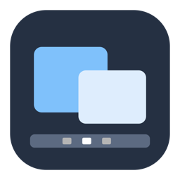
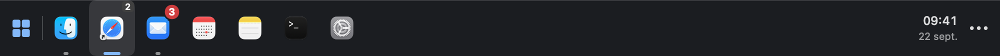

<div align="center">
  

  <h1>MacBar</h1>

  <p><strong>Your apps, your windows, one taskbar.</strong></p>
  <p>A native taskbar for macOS, inspired by Windows.<br>Pin, rearrange, preview, and find your windows with a click.</p>

  <p>
    
    
    
    
  </p>

  <p>
    <a href="#features">Features</a> ·
    <a href="#installation">Installation</a> ·
    <a href="#macos-permissions">Permissions</a> ·
    <a href="#usage">Usage</a> ·
    <a href="#troubleshooting">Troubleshooting</a> ·
    <a href="#development">Development</a>
  </p>
</div>



<p align="center"><sub>Interface rendering with sample applications and counters.</sub></p>

## Why MacBar?

The Dock shows applications. MacBar adds a window-focused workflow: return to the last window you used, preview others on hover, keep favorites within reach, and hide an application with a click.

The taskbar is compact, left-aligned, and built with **Swift, AppKit, and SwiftUI**, with no third-party application dependencies. It requires no account, telemetry, or remote service.

> **Work in progress.** Some integrations rely on macOS Accessibility and depend on how applications behave. Dock menus and window fitting have limitations described below.

## Features

| | What MacBar offers |
| --- | --- |
| **Grouped applications** | One icon per application, with access to its windows. An ungrouped mode is also available. |
| **Favorites and organization** | Pin from the launcher, the context menu, or by dropping an application. Drag to rearrange; your order survives restarts. |
| **Last-used window** | Click a background application to bring its last-used window forward. |
| **⌘H-style hiding** | Click the active application to hide it; click again to show it, without minimizing its windows into the Dock. |
| **Hover previews** | Window thumbnails, selection, and closing from the preview panel. Images require macOS 14+ and permission. |
| **Dock actions** | Right-click to access actions exposed in the application's Dock menu, with a local fallback menu. |
| **Notification badges** | Display badges exposed by the Dock, including counts, labels, and compact “99+” formatting. |
| **Application launcher** | Search, open, and pin applications, with keyboard navigation. |
| **Room for windows** | Adjust maximized window height so windows stop above the taskbar. |
| **Native options** | Multiple displays, launch at login, and access to options from the macOS menu bar. |

## Installation

These instructions install MacBar **from source**, using a signing identity created locally on your Mac. An Apple developer account is not required.

### Requirements

- **macOS 13 or later**; macOS 14+ for window thumbnails.
- **Recent Apple developer tools**: Xcode or Command Line Tools, with an SDK that includes the macOS 14 APIs used by ScreenCaptureKit.
- **OpenSSL 3**, available as `openssl`, to create the local certificate.
- **Python 3** if the compiler wrapper needs to apply its Command Line Tools compatibility fix.

The project is tested on **Apple Silicon**. The build script targets the architecture of the Mac performing the build; Intel compatibility has not been validated.

Install Apple's tools if needed:

```sh
xcode-select --install
```

If you use Homebrew, prepare [OpenSSL 3](https://formulae.brew.sh/formula/openssl@3) in your build terminal:

```sh
brew install openssl@3
export PATH="$(brew --prefix openssl@3)/bin:$PATH"
openssl version
```

The last command should report **OpenSSL 3.x**, rather than the LibreSSL bundled with macOS.

### Build and launch

Clone the repository and enter the project directory:

```sh
git clone git@github.com:KiwiTerra/MacBar.git
cd MacBar

# Check application logic.
./scripts/test.sh

# Create the local signing identity once.
./scripts/setup-signing.sh

# Build, sign, and install in ~/Applications.
./scripts/install.sh

# Launch MacBar.
open "$HOME/Applications/MacBar.app"
```

Keychain may ask for permission to use the signing key. The application installs in `~/Applications/MacBar.app` and runs as a menu bar utility.

### Updating

Quit MacBar from its `…` menu, pull the latest sources, then run:

```sh
./scripts/install.sh
open "$HOME/Applications/MacBar.app"
```

**Keep the same signing certificate.** It lets macOS recognize updated builds as the same application. The script refuses to replace a running instance and does not silently fall back to an ad hoc signature.

<details>
<summary><strong>How does local signing work?</strong></summary>

The `setup-signing.sh` script creates a “MacBar Local Code Signing” certificate valid for ten years. Its private key is imported into the login keychain as non-exportable, with access granted to `/usr/bin/codesign`. Temporary files containing the key are deleted after import.

The public certificate and its fingerprint are stored here:

```text
~/Library/Application Support/MacBar/Signing/
```

Subsequent builds use the same identity. Accessibility permission retention across updates has been verified on the development Mac; changing the certificate requires granting permission again.

This signature is intended for local installation. It is neither a Developer ID signature nor notarization for distributing a binary to other users.

</details>

## macOS permissions

MacBar requests the access needed for the features you use.

| Permission | Purpose | Without it |
| --- | --- | --- |
| **Accessibility** | List and control windows, adjust their height, and read Dock menus and badges. | The launcher and application launching remain available; window features are limited. |
| **Screen Recording** | Generate thumbnails through ScreenCaptureKit on macOS 14+. | With Accessibility enabled, the panel shows window titles and icons instead of images. |

### Enable Accessibility

1. Open the launcher using the **Applications** button on the left.
2. Click **Open Accessibility Settings**.
3. Enable **MacBar** in **System Settings → Privacy & Security → Accessibility**.
4. If needed, add `~/Applications/MacBar.app` using the `+` button.

### Enable thumbnails

Hover over an application with a window, then click **Enable Previews**. Allow MacBar in the screen recording settings. The exact name of this section varies by macOS version. Restart the application if macOS requests it.

## Usage

| Gesture | Result |
| --- | --- |
| **Left-click a background app** | Shows its last-used window. |
| **Left-click the active app** | Hides the entire application, like **⌘H**, in grouped mode. |
| **Left-click a hidden app** | Shows and activates it. |
| **Hover over an icon** | Shows the window panel. |
| **Click a thumbnail** | Shows that window. |
| **Click a preview's close button** | Closes that window. |
| **Right-click or Control-click** | Opens application actions and MacBar commands. |
| **Drag an icon within the taskbar** | Changes its position; the blue line marks the insertion point. |
| **Drop an `.app` file from Finder** | Pins the application at the chosen position. |
| **Applications button** | Opens the launcher to search, launch, or pin an app. |
| **`…` menu** | Grouping, displays, launch at login, taskbar visibility, and quitting MacBar. |

In the launcher, use **↑ / ↓** to select an application, **Return** to open it, and **Escape** to close the panel. The pin on the right of each row adds or removes a favorite.

In ungrouped mode, each window has its own button. Clicking another window selects it; clicking the already-active window hides its entire application.

### Reading the indicators

- **Blue line**: active application or window.
- **Gray dot**: application running in the background.
- **Small counter**: number of windows in a group.
- **Red badge**: badge supplied by the Dock, taking priority over the window count. Numbers above 99 appear as **99+**.

An unpinned application disappears when its last window closes. An application hidden with ⌘H or with a minimized window remains accessible. Favorites remain visible even when closed.

## Working alongside the Dock

MacBar **does not disable the Dock or change its preferences**. To use the taskbar at the bottom edge of the screen, enable automatic Dock hiding in **System Settings → Desktop & Dock**. A shortcut to these settings is available in the `…` menu.

The Dock continues to supply application menus and badges. Its menu may appear briefly when you right-click: MacBar must open it to read its actions, then reopen it to execute the selected action.

Maximized windows are adjusted after resizing. macOS does not natively reserve desktop space for MacBar. True full-screen mode remains managed by macOS in its dedicated Space; MacBar is not forced above it.

## Privacy

- No account, remote service, usage tracking, or application network calls.
- Preferences and application order stay on your Mac.
- Thumbnails stay **in memory**, without being saved to disk during normal use.
- Badges come from Dock information: MacBar does not read message contents to calculate counts.
- Test modes can export MacBar views when explicitly requested.

The hover panel opens after **120 ms**. Initial thumbnails are prepared during that delay, then refreshed roughly once per second. An in-memory cache limited to 24 images and 16 MB briefly reuses captures less than five seconds old.

## Known limitations

- **Application compatibility.** Some applications expose their windows poorly through Accessibility. Launching remains possible, but not every interaction is guaranteed.
- **Resizing.** An application that refuses size changes or enforces a minimum height may still overlap the taskbar. Maximized windows remain resizable according to native macOS behavior.
- **Zoom restoration.** MacBar remembers window geometry. Without history, the fallback restore size is 75% of the available area; applications with special constraints may behave differently.
- **Thumbnails.** Protected windows, some minimized windows, or some apps may not provide images. macOS 13 uses titles and icons.
- **Dock menus.** Experimental integration that depends on what the Dock exposes. Applications absent from the Dock use a fallback menu; not all submenus have been validated. Actions supplied by macOS or another application retain their original language.
- **Badges.** Only badges exposed by the Dock can be read. Counts internal to an application or drawn into its icon are not automatically retrieved. Refresh timing also depends on the source application.
- **Spaces and displays.** The list may include windows on other Spaces. Multiple-display features are available, but not every configuration has been tested.
- **Distribution.** Current scripts build and sign for local use; they do not produce a notarized universal binary.

## Troubleshooting

<details>
<summary><strong>Windows, menus, or badges are missing</strong></summary>

Check **Accessibility** access and restart MacBar. For badges, compare with the application's Dock icon: MacBar uses what the Dock exposes. A new notification may be needed for the application to refresh its badge.

</details>

<details>
<summary><strong>The panel shows titles but no thumbnails</strong></summary>

Images require macOS 14+ and screen recording permission. Use **Enable Previews**, then restart MacBar if needed. Some windows cannot be captured even with permission.

</details>

<details>
<summary><strong>macOS asks for permission again after an update</strong></summary>

Check that the build uses the original local certificate. Do not delete its key from Keychain or the `Signing` folder. If the identity changed, remove the old MacBar entry from settings, add the newly installed application, and restart it.

</details>

<details>
<summary><strong>Certificate creation fails</strong></summary>

Run `openssl version`. The setup script uses OpenSSL 3 to generate the certificate, then macOS's `/usr/bin/openssl` to create a Keychain-compatible container. Also ensure the login keychain is accessible and grant any access requested by macOS.

</details>

<details>
<summary><strong>The build reports a duplicate SwiftBridging module</strong></summary>

Use the repository scripts. The `scripts/swiftc.sh` wrapper detects certain duplicates left by a Command Line Tools update and applies a project-local overlay. No SDK files are modified. Python 3 is required for this fix.

</details>

<details>
<summary><strong>The taskbar is hidden and I cannot find its options</strong></summary>

Use the MacBar icon in the macOS menu bar to show the taskbar again or quit the application.

</details>

## Development

### Project structure

```text
MacBar/
├── Sources/MacBar/     Native interface, windows, and macOS integrations
├── Tests/               Logic tests and dedicated test applications
├── Resources/           Application icon
├── docs/assets/         README images
├── scripts/             Build, signing, installation, and tests
└── Package.swift        Swift package manifest
```

The reference build uses `swiftc` directly, without dependency resolution. `Package.swift` is also provided for compatible SwiftPM/Xcode environments.

### Useful commands

| Command | Purpose |
| --- | --- |
| `./scripts/test.sh` | Runs logic assertions without manipulating your working windows. |
| `./scripts/build.sh` | Produces the signed `build/MacBar.app` bundle. |
| `./scripts/install.sh` | Builds and installs in `~/Applications`. |
| `./scripts/test-signing.sh` | Checks that two bundles with different contents retain the same signing identity. |

Logic tests cover grouping, favorites, ordering, window selection, filtering apps without windows, badges, and geometry. Dedicated fixtures under `Tests/` check AppKit interactions, the Dock, and hiding in a graphical environment. Not all of them run through `test.sh`.

### Startup test

First quit the normal instance, then launch the installed version through Launch Services to preserve the correct macOS permission context:

```sh
open -n -W \
  --stdout "$PWD/.build/smoke.log" \
  --stderr "$PWD/.build/smoke-errors.log" \
  "$HOME/Applications/MacBar.app" \
  --args --smoke-test

cat .build/smoke.log
```

The test shows the taskbar for a few seconds, writes a JSON report, and closes its instance. Add `--snapshot-dir "$PWD/.build/screenshots"` after `--smoke-test` to export taskbar and launcher views. Then relaunch MacBar normally.

### Reporting an issue or proposing a change

Include the macOS version, Mac architecture, affected application, steps to reproduce, and expected behavior. Specify granted permissions if the issue concerns windows, previews, or the Dock. Hide personal information in shared screenshots and logs.

Changes can include a logic test or native fixture when behavior depends on AppKit. Distinguish automated checks from manual validation.

## Uninstalling

1. Disable **Launch at Login** in the `…` menu if enabled.
2. Quit MacBar.
3. Delete `~/Applications/MacBar.app`.
4. Remove its macOS permissions if you no longer plan to use it.

To also remove local preferences while the application is stopped:

```sh
defaults delete dev.local.MacBar
```

This removes favorites and their order, among other settings. You can keep the certificate and `Signing` folder to reinstall with the same identity.
